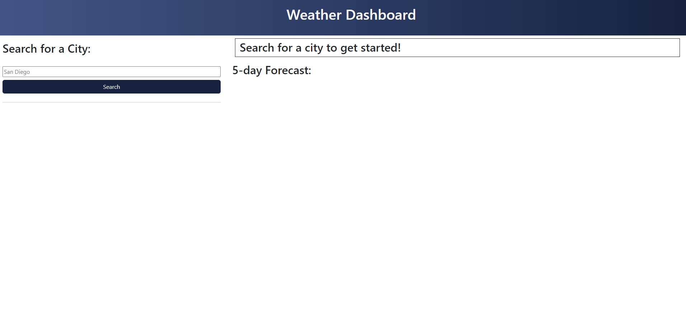
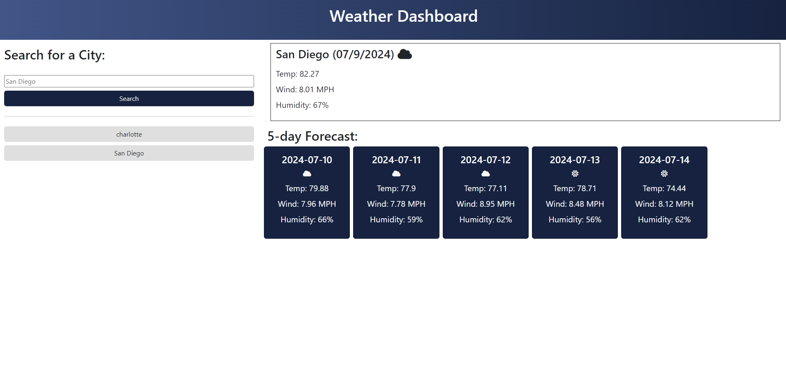

# Weather Dashboard

## About

This project allows the user to input a city, then see relevant weather info - including temperature, wind speed, and humidity - for the present, along with average weather data values for the next 5 days. This allows users to check important weather data for the present and future in any major city.
I built this project as a means of practicing several important facets of frontend development: chiefly, fetching data via HTTP requests using server-side APIs, and parsing and displaying that data in HTML. To fetch the data, I had to create and chain several fetch requests - first in order to retrieve the city coordinates, then to create a new request using those coordinates to retrieve the weather data. I then had to display certain specific data points using HTML. In addition, through using Bootstrap to style my page, I gained experience using CSS frameworks. 

## Usage

To get started, go [here!](https://otekolste.github.io/weather-dashboard)

Get started by inputting a city into the search bar and clicking 'Search.'

The weather data will appear on the right. Data for the present will appear in the top box, whereas data for the next five days will appear in 5 blue squares below. Note that this dashboard takes the average temperature, humidity, and wind speed across 8 3-hour timestamps. An icon will also indicate the weather conditions for the day (the icons are based on the conditions at the beginning of the day.)

When you search for a city, it will save that search, appearing to the left beneath the search button. You can click on that city name to re-retrieve the data. That data will persist if you close out and return to the page, or refresh it (note that invalid city names will NOT persist). Duplicate city names will not persist.

## Credits

Icons displaying weather conditions sourced from Font Awesome: https://fontawesome.com/

Weather data retrieved using the Open Weather API: https://openweathermap.org/api

## License

Available to view in the root directory, in the file entitled LICENSE.